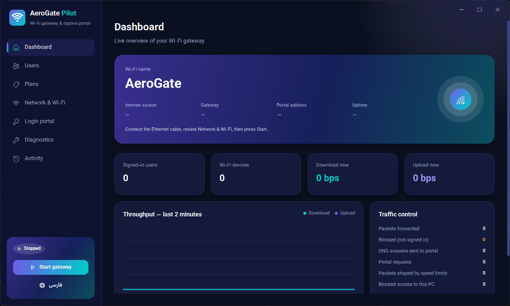
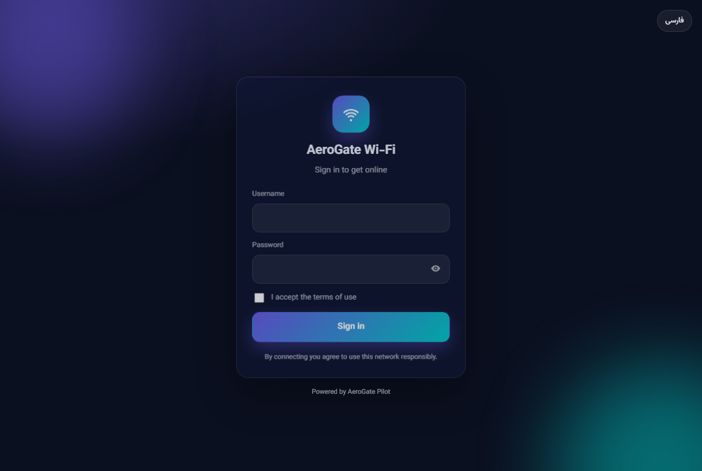
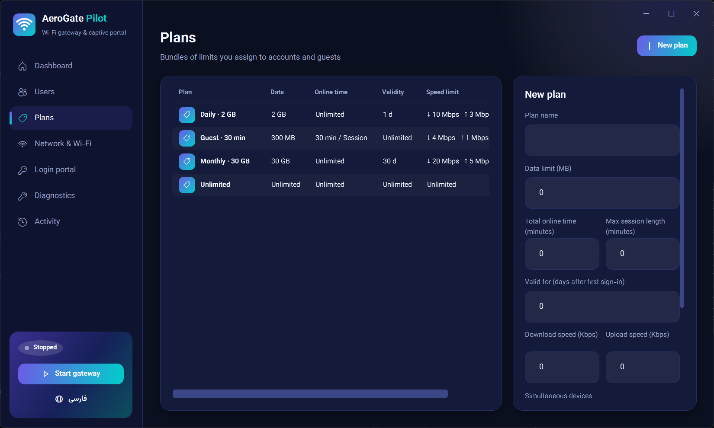

<h1 align="center">AeroGate Pilot</h1>

<p align="center">
  <strong>Turn a Windows PC into a Wi‑Fi gateway with a captive portal.</strong><br/>
  Ethernet in · Hotspot out · Sign‑in · Plans · Site rules · Built‑in Xray
</p>

<p align="center">
  <a href="https://github.com/Hasanwlip/AeroGatePilot/releases"></a>
  <a href="LICENSE"></a>
  
  
  
</p>

<p align="center">
  <a href="#quick-start">Quick start</a> ·
  <a href="#features">Features</a> ·
  <a href="#vpn--xray-core">VPN / Xray</a> ·
  <a href="#راهنمای-فارسی">فارسی</a> ·
  <a href="#author">Author</a>
</p>

---

**AeroGate Pilot** shares your PC’s internet over Wi‑Fi and holds every client at a **login page** until they authenticate. After sign‑in, each account follows a **plan**: data volume, online time, session length, validity days, download/upload speed, and how many devices can stay online.

Need to block Instagram but keep work sites? Or open *only* one domain after login? Plans support **block lists** and **allow lists** with `*.domain` wildcards. Need users to browse through a tunnel? Import a `vless://` link — the app ships **Xray-core** beside the EXE and connects directly (no Clash port required).

Built for cafés, classrooms, offices, events, and home labs. One installer. One dashboard. English and Persian (RTL).

> **v1.0** is the first public baseline: the full feature set below is intended to be stable enough to run and fork.

<p align="center">
  
</p>

<p align="center">
  
  &nbsp;
  
</p>

---

## Quick start

1. Download the latest **setup** or **portable** build from [Releases](https://github.com/Hasanwlip/AeroGatePilot/releases).
2. Run **AeroGate Pilot** as Administrator (UAC prompt is expected).
3. Open **Diagnostics** — aim for green checks.
4. **Network & Wi‑Fi** — pick the Ethernet (WAN) source, set SSID / password, **Save**.
5. Adjust **Plans** and **Users** (or enable guest mode on **Login portal**).
6. Optional: **Network → VLESS / Core** — paste share links, ping, select a server, **Save**.
7. Press **Start gateway**. Clients joining the SSID are sent to the portal.

**Stop gateway** (or close the app) restores previous Windows hotspot settings — including after a crash, on the next launch.

| Asset | Use |
| --- | --- |
| `AeroGatePilot-*-win-x64-setup.exe` | Installer (recommended) |
| `AeroGatePilot-*-win-x64-portable.zip` | Zip next to a folder; run the EXE elevated |

---

## Features

### Gateway
- Windows **Mobile Hotspot** + Internet Connection Sharing (NAT / DHCP / DNS)
- Automatic ICS repair when phones associate but get no IP
- WinDivert packet filter for portal enforcement, quotas, and routing
- Clean teardown and snapshot restore of hotspot settings

### Captive portal
- Username/password, guest click‑through, or both
- Custom title, colors, logo, background, CSS (EN + FA)
- Exportable HTML/CSS/JS templates under `%ProgramData%\AeroGatePilot`

### Accounts & plans
| Limit | Meaning |
| --- | --- |
| Data (MB) | Total download + upload |
| Total online time | Across all sessions |
| Max session length | Cap for one sign‑in |
| Valid for (days) | From first login |
| Download / Upload (Kbps) | Per‑device speed |
| Max devices | Extra sign‑ins refused |

`0` = unlimited. Kick devices, reset usage, or disable accounts anytime.

### Website access (per plan)
- **All sites** · **Block list** · **Only list**
- `example.com` = exact host · `*.example.com` = apex + every subdomain
- Enforced via DNS + TLS SNI / HTTP Host (IP shortcuts don’t help)
- QUIC / DoH / DoT / Private Relay refused while filtering is on

### VPN / Xray core
- **Built‑in Xray** in `core\` next to the app  
  Import `vless://` · `vmess://` · `trojan://` · `ss://` · ping · select · go  
- Or **external app port** (Clash / v2rayN SOCKS or HTTP)
- Scope: all users, or only plans with “Route through VPN”
- Optional direct fallback if the tunnel is down

### Desktop app
- Modern dark UI, English + **Persian RTL**
- Dashboard, live sessions, diagnostics, activity log
- Self‑contained win‑x64 publish (single‑file app + WinDivert + Xray)

---

## Requirements

- Windows 10 (2004 / build 19041+) or Windows 11, **64‑bit**
- Ethernet (or another shareable WAN) + Wi‑Fi adapter with **Mobile Hotspot**
- **Administrator** rights (hotspot + WinDivert driver)

---

## Build from source

```powershell
# .NET 8 SDK
dotnet test .\tests\AeroGatePilot.Tests -c Release
.\tools\publish.ps1
```

Output lands in `dist\` (portable folder, zip, and Inno Setup installer when ISCC is installed).  
`publish.ps1` downloads **Xray-windows-64** into `third_party\xray` on first run and copies it to `dist\...\core\`.

### Solution layout

```
src/
  AeroGatePilot.App/             WPF dashboard
  AeroGatePilot.Core/            Plans, sessions, filters, share-link parser
  AeroGatePilot.Infrastructure/  Hotspot, WinDivert, Xray host, SQLite
  AeroGatePilot.Portal/          Kestrel captive portal
tests/
  AeroGatePilot.Tests/
```

---

## Data & privacy

Runtime data lives under `%ProgramData%\AeroGatePilot` (database, settings, branding, logs).  
The folder is restricted to Administrators. Uninstall can optionally remove it.

Third‑party components: [WinDivert](https://reqrypt.org/windivert.html) (packet filter), [Xray-core](https://github.com/XTLS/Xray-core) (optional VPN), Vazirmatn (Persian UI font). Licenses ship in `licenses\`.

---

## Troubleshooting

| Symptom | What to try |
| --- | --- |
| Hotspot SSID missing | Diagnostics → run as Admin; enable Mobile Hotspot in Windows Settings |
| Phone connects, no IP | App auto‑repairs ICS; reboot; remove VPN filters that break sharing |
| Portal won’t open | Confirm firewall rule; open `http://192.168.137.1/portal/` |
| Xray SOCKS won’t start | Use **Ping** on the server (not only Ping all); reinstall so `core\xray.exe` exists |
| “Already running” | Quit the tray/elevated instance before starting another copy |

---

## Author

**Hasanwlip** · nodeflex  

Full‑stack builder shipping practical Windows networking tools.  
GitHub: [github.com/Hasanwlip](https://github.com/Hasanwlip)

If AeroGate Pilot helps your café, classroom, or lab — a star on the repo is appreciated. Issues and PRs welcome.

---

## License

[MIT](LICENSE) © 2026 Hasanwlip (nodeflex)

WinDivert, Xray-core, and fonts remain under their own licenses.

---

## راهنمای فارسی

**AeroGate Pilot** کامپیوتر ویندوزی را به **گیت‌وی وای‌فای با صفحه ورود** تبدیل می‌کند: اینترنت از کابل، پخش روی وای‌فای، ورود اجباری، پلن حجم/زمان/سرعت/دستگاه، فیلتر سایت، و در صورت نیاز تونل از **هسته Xray داخل برنامه** (لینک VLESS و مشابه).

### شروع سریع
1. از [Releases](https://github.com/Hasanwlip/AeroGatePilot/releases) نسخه نصب یا پرتابل را بگیرید.
2. برنامه را **به‌عنوان Administrator** اجرا کنید.
3. **عیب‌یابی** را سبز کنید؛ در **شبکه و وای‌فای** منبع اینترنت و SSID را تنظیم و ذخیره کنید.
4. پلن و کاربر بسازید (یا مهمان را در صفحه ورود فعال کنید).
5. اختیاری: **VLESS / Core** — لینک را وارد کنید، پینگ بگیرید، سرور را انتخاب و ذخیره کنید.
6. **شروع سرویس** را بزنید.

### قابلیت‌های نسخه ۱
هات‌اسپات + تعمیر خودکار ICS · پورتال سفارشی (لوگو/رنگ/CSS، انگلیسی و فارسی) · کاربران و پلن‌ها · لیست مسدود / فقط این لیست با `*.دامنه` · Xray داخلی یا پورت Clash · داشبورد و گزارش رویدادها.

### سازنده
**Hasanwlip (nodeflex)** — [github.com/Hasanwlip](https://github.com/Hasanwlip)

مجوز: MIT
